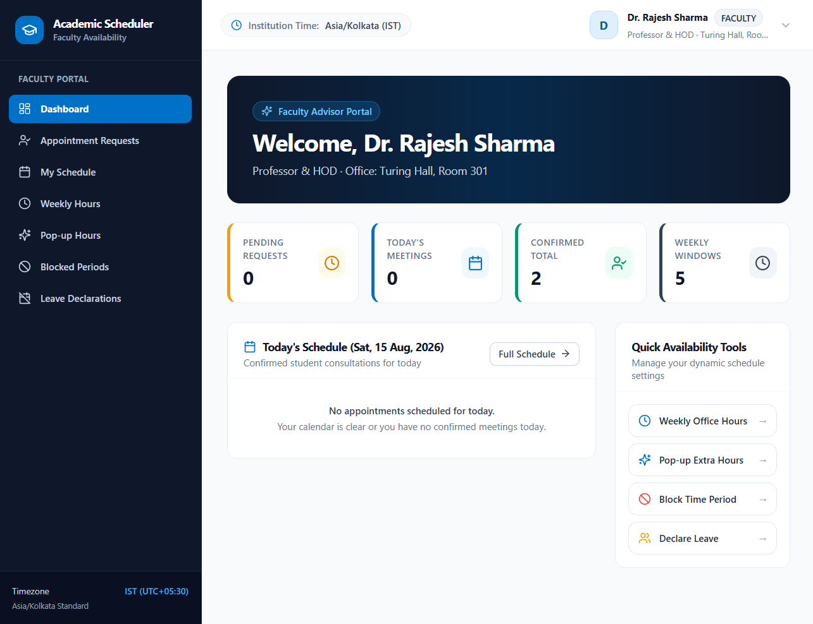

# Faculty Availability & Appointment Scheduler

A full-stack academic scheduling platform that helps students find real-time faculty availability and request appointments, while giving faculty control over office hours, leave, blocked periods, and bookings.

The system dynamically calculates bookable time slots instead of relying on pre-generated static slots.

> Built with React, TypeScript, FastAPI, PostgreSQL, SQLAlchemy, and Alembic.

[](#-testing)
[](#-testing)
[](https://www.python.org/)
[](https://react.dev/)
[](https://fastapi.tiangolo.com/)
[](https://www.postgresql.org/)

---

## 📌 Problem Overview

Students often struggle to know when a faculty member is actually available
for a discussion, consultation, or academic meeting.

Faculty availability can change because of:

- Regular teaching schedules
- Meetings and other commitments
- Temporary office hours
- Blocked periods
- Planned leave
- Existing appointments

Traditional systems often rely on fixed schedules or manual communication,
which can result in unnecessary back-and-forth and conflicting bookings.

This project provides a centralized system where faculty can manage their
availability and students can discover and request genuinely bookable time
slots in real time.

---

## 📸 Preview

### Faculty Availability



---

## ✨ Key Features

### 👨‍🎓 Student

- Search and browse faculty members
- View real-time faculty availability
- Select available appointment slots
- Submit appointment requests
- Track appointment status
- Cancel appointments

### 👨‍🏫 Faculty

- Manage recurring weekly office hours
- Publish one-time temporary office hours
- Create temporary blocked periods
- Declare planned leave
- Review student appointment requests
- Accept or reject requests
- Complete or cancel appointments
- Manage their consultation schedule

### 🛡️ Administrator

- View system-wide statistics
- Manage users and account status
- Manage faculty profiles
- Manage academic departments
- Maintain institutional data

### ⚙️ Scheduling Engine

- Dynamically calculate available slots
- Combine regular and temporary availability
- Apply blocked periods and leave
- Exclude active appointments
- Generate discrete bookable slots
- Handle current-day expiration
- Respect the institutional `Asia/Kolkata` timezone

---

## 🧠 Technical Highlights

### 1. Dynamic Availability Engine

The system does not store pre-generated bookable slots.

Availability is calculated dynamically from:

```text
(Regular Availability ∪ Temporary Availability)
                − Blocked Periods
                − Approved Leave
                − Active Appointments
                ↓
          Bookable Slots
```

This allows faculty availability to change without maintaining static appointment-slot records.

### 2. Concurrency-Safe Booking

When multiple students attempt to book the same slot simultaneously, the backend performs an atomic PostgreSQL transaction and locks the target faculty resource using `SELECT ... FOR UPDATE`.

The booking flow:

1. Recalculates current availability
2. Checks for conflicting appointments
3. Creates the appointment only if the slot is still available
4. Returns `409 SLOT_UNAVAILABLE` if another transaction has already reserved the slot

This provides concurrency-safe protection against double-booking.

### 3. Role-Based Access Control

The application provides separate permissions for:

- **Student**
- **Faculty**
- **Administrator**

Authorization is enforced on the backend rather than relying only on frontend route protection.

### 4. Appointment State Machine

Appointments follow a controlled lifecycle:

```text
REQUESTED
   ├── ACCEPTED ──→ COMPLETED
   │      └───────→ CANCELLED
   ├── REJECTED
   └── CANCELLED
```

Terminal states cannot be modified through invalid transitions.

### 5. Timezone-Aware Scheduling

The application uses `Asia/Kolkata` as the institutional timezone and handles current-day slot expiration using backend time calculations.

### 6. Privacy-Aware Availability

Students receive only the information required to determine whether a faculty member is available.

Sensitive internal leave information is restricted to authorized faculty and administrator views.
---

## 🧠 Scheduling Engine & Availability Algebra

### Dynamic Availability Formula
Instead of statically generating calendar slots, availability is dynamically computed on-demand using continuous interval set operations:

$$\mathcal{A}_{\text{final}} = \Big( \big( \mathcal{R} \cup \mathcal{T} \big) \setminus \mathcal{B} \Big) \setminus \Big( \mathcal{L} \cup \mathcal{P} \cup \mathcal{C} \Big)$$

- **$\mathcal{R}$ (Regular)**: Recurring weekly office hours for the requested day-of-week.
- **$\mathcal{T}$ (Temporary)**: Extra pop-up hours for the specific date.
- **$\mathcal{B}$ (Blocks)**: Temporary blocked periods.
- **$\mathcal{L}$ (Leave)**: Approved faculty leaves.
- **$\mathcal{P}$ (Pending)** & **$\mathcal{C}$ (Confirmed)**: Existing appointment reservations.

### PostgreSQL Concurrency Protection
To prevent double-booking race conditions during simultaneous requests, the backend employs **PostgreSQL Row-Level Locking (`SELECT ... FOR UPDATE`)** on the target `Faculty` record. This serializes concurrent booking transactions, ensuring exactly one student succeeds while subsequent conflicting requests receive a `409 Conflict (SLOT_UNAVAILABLE)` error.

---

## 🛠️ Technology Stack

| Layer | Technology | Purpose |
| :--- | :--- | :--- |
| **Backend** | Python 3.13, FastAPI | REST API and backend business logic |
| **ORM & DB** | PostgreSQL, SQLAlchemy 2.0, Alembic | Relational database layer with schema migrations |
| **Security** | JWT (HS256), bcrypt | Token authentication, password hashing, and server-side RBAC |
| **Frontend** | React 18, TypeScript (Strict Mode), Vite | Component-driven, type-safe web application |
| **Styling** | Tailwind CSS, Lucide React | Modern academic design system |
| **Data Fetching** | TanStack Query (React Query v5) | Server-state caching and automated query invalidation |
| **Client Routing** | React Router v6 | Role-based protected routing |
| **Testing** | Pytest, Vitest, Testing Library | Unit, integration, and concurrency testing |
| **Infrastructure** | Docker, Docker Compose | Containerized development and deployment |
---

## 🏗️ System Architecture

The application follows a layered full-stack architecture:

```text
┌─────────────────────────────────────────────┐
│              React Frontend                 │
│   Student • Faculty • Administrator         │
└──────────────────────┬──────────────────────┘
                       │ REST API / JWT
                       ▼
┌─────────────────────────────────────────────┐
│               FastAPI                       │
│        API Routes + RBAC + Validation       │
└──────────────────────┬──────────────────────┘
                       ▼
┌─────────────────────────────────────────────┐
│              Service Layer                  │
│                                             │
│  Availability Engine  │  Appointment Engine │
│  Leave Management     │  User Management    │
└──────────────────────┬──────────────────────┘
                       ▼
┌─────────────────────────────────────────────┐
│          Repository / ORM Layer             │
│             SQLAlchemy 2.0                 │
└──────────────────────┬──────────────────────┘
                       ▼
┌─────────────────────────────────────────────┐
│               PostgreSQL                    │
│      Users • Faculty • Availability         │
│      Leave • Appointments • Departments     │
└─────────────────────────────────────────────┘
```

### Availability Flow

```text
Regular Availability ─────┐
                          │
Temporary Availability ──┤
                          ▼
                    Availability
                       Engine
                          │
Blocked Periods ──────────┤
                          │
Approved Leave ───────────┤
                          │
Active Appointments ──────┘
                          │
                          ▼
                  Bookable Time Slots
```

### Booking Flow

```text
Student selects slot
        ↓
Backend validates request
        ↓
Availability recalculated
        ↓
PostgreSQL transaction begins
        ↓
Faculty row locked
        ↓
Conflict check
    ┌───┴────┐
    │        │
 Conflict   Available
    │        │
   409       ↓
           Create
         appointment
              ↓
            Commit
```
---
## 💻 Local Development Setup

### Prerequisites

Make sure the following are installed:

- Python 3.13+
- Node.js 18+ and npm
- PostgreSQL
- Git

---

### 1. Clone the Repository

```bash
git clone https://github.com/Prajwal020/faculty-availability-scheduler.git
cd faculty-availability-scheduler
```

---

### 2. Backend Setup

Navigate to the backend directory:

```bash
cd backend
```

Create a Python virtual environment:

```bash
python -m venv venv
```

Activate the virtual environment.

**Windows — PowerShell:**

```powershell
.\venv\Scripts\Activate.ps1
```

**Windows — Command Prompt:**

```cmd
venv\Scripts\activate
```

**Linux/macOS:**

```bash
source venv/bin/activate
```

Install the backend dependencies:

```bash
pip install -r requirements.txt
```

#### Configure Environment Variables

Copy the example environment file:

```text
.env.example → .env
```

Configure the values in `.env` according to your local PostgreSQL setup.

For example:

```env
ENVIRONMENT=development
DATABASE_URL=postgresql://<username>:<password>@localhost:5432/<database_name>
JWT_SECRET_KEY=<your-development-secret>
ACCESS_TOKEN_EXPIRE_MINUTES=1440
CORS_ORIGINS=http://localhost:5173
TIMEZONE=Asia/Kolkata
```

> **Important:** Never commit `.env` or real credentials to GitHub.

#### Run Database Migrations

Apply the database schema:

```bash
alembic upgrade head
```

#### Seed Development Data

Populate the database with sample departments, users, faculty members, students, availability, and demo data:

```bash
python scripts/seed_data.py
```

#### Start the Backend

```bash
uvicorn app.main:app --reload --port 8000
```

The backend API will be available at:

```text
http://127.0.0.1:8000
```

Interactive API documentation:

```text
http://127.0.0.1:8000/docs
```

Alternative API documentation:

```text
http://127.0.0.1:8000/redoc
```

Health check:

```text
http://127.0.0.1:8000/health
```

---

### 3. Frontend Setup

Open a **new terminal** and navigate to the project root:

```bash
cd faculty-availability-scheduler/frontend
```

Install frontend dependencies:

```bash
npm install
```

#### Configure Environment Variables

Copy:

```text
.env.example → .env
```

Set the backend API URL:

```env
VITE_API_BASE_URL=http://127.0.0.1:8000
```

> Frontend environment variables prefixed with `VITE_` are exposed to the browser. Never place secrets, database credentials, or JWT signing keys in frontend environment variables.

#### Start the Frontend

```bash
npm run dev
```

The frontend will be available at:

```text
http://localhost:5173
```

---

### 4. Run the Application

Once both services are running:

```text
PostgreSQL
    ↓
FastAPI Backend
http://127.0.0.1:8000
    ↓
React Frontend
http://localhost:5173
```

Open the frontend in your browser:

```text
http://localhost:5173
```

Use the seeded development accounts to explore the Student, Faculty, and Administrator portals.

> **Note:** Seed accounts and their credentials are intended for local development and demonstration only. Do not use them in a production deployment.


---

### 6. PostgreSQL Concurrency Test

The project includes a dedicated PostgreSQL integration test for verifying concurrent booking protection.

Configure:

```env
TEST_POSTGRESQL_URL=postgresql://<username>:<password>@localhost:5432/<test_database>
```

Then run:

```bash
pytest -v tests/test_concurrency_postgres.py
```

This test verifies that simultaneous attempts to book the same faculty slot are serialized by PostgreSQL row-level locking and that only one booking succeeds.
---

## 🔑 Demo & Test Credentials

The seed script creates pre-configured demo accounts for all roles:

| Role | Email | Password | Details |
| :--- | :--- | :--- | :--- |
| **Admin** | `admin@institution.edu` | `AdminPassword123!` | System Administrator |
| **Faculty** | `prof.sharma@institution.edu` | `FacultyPassword123!` | Dr. Rajesh Sharma (CS Dept, Turing Hall 301) |
| **Faculty** | `prof.menon@institution.edu` | `FacultyPassword123!` | Dr. Ananya Menon (Math Dept, Euler Block 204) |
| **Student** | `student.alex@institution.edu` | `StudentPassword123!` | Alex Rivera (Computer Science Major) |
| **Student** | `student.priya@institution.edu` | `StudentPassword123!` | Priya Patel (Data Science Major) |

*(The login screen includes 1-click credential selector buttons for instant demo access).*

---

## 🧪 Automated Testing

The project includes separate backend and frontend test suites covering
authentication, authorization, scheduling logic, appointment workflows,
security boundaries, and UI behavior.

### Backend

```text
73 passed
1 skipped
0 failed
```

The backend tests cover:

- Authentication and RBAC
- User and department management
- Dynamic availability and interval algebra
- Leave and availability APIs
- Appointment lifecycle
- Authorization and IDOR protection
- Transaction rollback
- Concurrency-related behavior

A dedicated PostgreSQL concurrency test is available for verifying
real row-level locking against PostgreSQL.

### Frontend

```text
20 passed
0 failed
```

Frontend tests cover:

- Formatting utilities
- Status badges
- Protected routes
- Faculty management
- Appointment booking UI

### Production Build

The frontend production build has been verified successfully with
TypeScript compilation and Vite production bundling.

```bash
npm run build
```

### Running Tests

Backend:

```bash
cd backend
pytest -v
```

Frontend:

```bash
cd frontend
npm test
```
---

## 🔐 Security

Security is enforced primarily on the backend, with the frontend acting as the presentation and interaction layer.

### Authentication

- JWT Bearer token authentication
- bcrypt password hashing
- Token expiration and validation
- Automatic handling of expired/invalid sessions

### Role-Based Access Control

The system supports three roles:

| Role | Access |
| :--- | :--- |
| **Student** | Faculty discovery, availability, appointment requests and personal appointments |
| **Faculty** | Availability, leave, blocked periods, appointment management and personal schedule |
| **Administrator** | User, faculty and department management |

Authorization is enforced at the API level rather than relying only on frontend route guards.

### Resource Ownership

Protected resources are validated against the authenticated user to prevent unauthorized access to another user's data.

This includes appointment and faculty-related operations.

### Privacy

Faculty leave information is separated into public and privileged views.

Students can determine whether a faculty member is on leave without receiving sensitive internal leave details.

### Configuration Security

Secrets and environment-specific configuration are kept outside the application source code through environment variables.

Production configuration includes:

- Database credentials
- JWT secret
- CORS origins
- API configuration

Development `.env` files are excluded from version control.

---

## 🚢 Production Deployment

### Production Checklist
1. **Environment Variables**: Set `ENVIRONMENT=production`, secure `JWT_SECRET_KEY` (min 32 chars), and configure `DATABASE_URL` with your production PostgreSQL instance.
2. **CORS Origins**: Restrict `CORS_ORIGINS` to the exact deployed frontend origin (e.g. `https://scheduler.institution.edu`).
3. **Database Migrations**: Execute `alembic upgrade head` in your CI/CD deployment pipeline before starting application workers.
4. **Health Checks**: Monitor system health at `GET /health` and database connectivity at `GET /health/db`.

---

## 📚 Documentation

Detailed project documentation is available in the [`docs/`](docs/) directory.

| Document | Description |
| :--- | :--- |
| [Architecture](docs/architecture.md) | System architecture, backend layers, frontend structure, and scheduling design |
| [API Documentation](docs/api.md) | Major REST API endpoints and request/response workflows |
| [Database](docs/database.md) | Database entities, relationships, and schema design |
| [Deployment](docs/deployment.md) | Production deployment and environment configuration |
| [Demo Guide](docs/demo.md) | Recommended end-to-end application demonstration |
| [Resume Guide](docs/resume.md) | Resume-ready project description and technical highlights |
| [Portfolio Guide](docs/portfolio.md) | Project presentation, screenshots, and portfolio material |

---

## ⚠️ Known Limitations

The current version focuses on the core faculty availability and appointment workflow.

The following features are intentionally outside the current scope:

- Email or SMS notifications
- Recurring appointment series
- External calendar synchronization
- Mobile-native applications

These can be considered future extensions without changing the core scheduling architecture.

---

## 📌 Project Status

**Status: Deployment-Ready**

The core full-stack application has been implemented and locally verified across the Student, Faculty, and Administrator workflows.

### Verified

- Backend API and database integration
- PostgreSQL database support
- Dynamic faculty availability engine
- Faculty leave and availability management
- Appointment lifecycle
- Concurrency-safe booking
- JWT authentication and RBAC
- Frontend role-based dashboards
- Backend and frontend test suites
- Production frontend build
- Local full-stack integration

### Deployment Status

The application is **ready for deployment but has not yet been deployed to a public production environment**.

The next step is production deployment and verification.

---

## 📄 License
This project is open-source and available under the [MIT License](LICENSE).