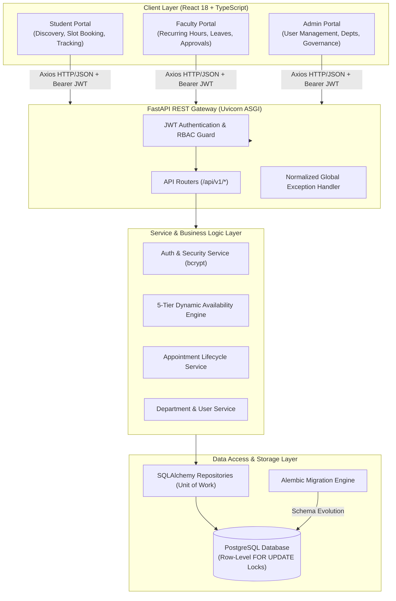
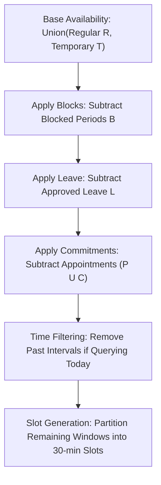
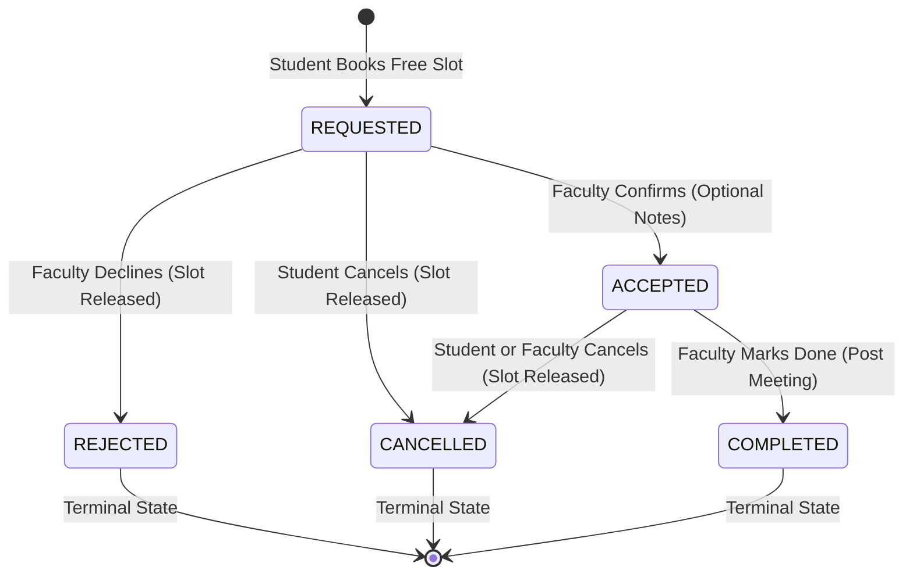
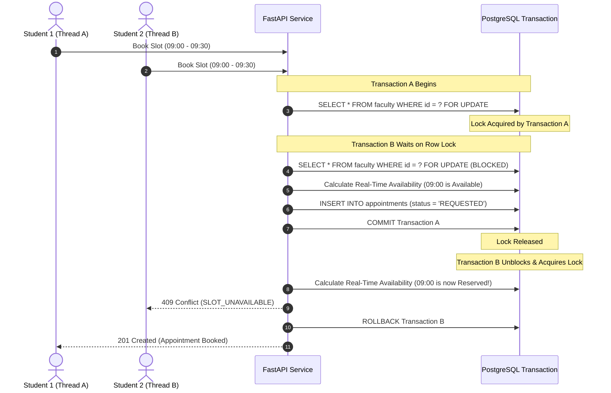

# Faculty Availability & Appointment Scheduler — Architecture Specification

This document provides a comprehensive technical architecture overview of the **Faculty Availability & Appointment Scheduler**, a production-grade full-stack platform built with FastAPI, PostgreSQL/SQLAlchemy, React, TypeScript, and TanStack Query.

---

## 1. High-Level System Architecture

---

## 2. 5-Tier Dynamic Availability Algebra

The platform uses interval algebra over continuous time intervals rather than static pre-allocated slots.

### The Canonical Precedence Formula:
$$\mathcal{A}_{\text{final}} = \Big( \big( \mathcal{R} \cup \mathcal{T} \big) \setminus \mathcal{B} \Big) \setminus \Big( \mathcal{L} \cup \mathcal{P} \cup \mathcal{C} \Big)$$

Where:
- $\mathcal{R}$: Regular recurring weekly office hours for the specified day-of-week.
- $\mathcal{T}$: Temporary/pop-up extra office hours scheduled for this specific calendar date.
- $\mathcal{B}$: Temporary blocked periods (busy periods, thesis defenses, conferences).
- $\mathcal{L}$: Approved faculty leave periods (`FULL_DAY`, `HALF_DAY_MORNING`, `HALF_DAY_AFTERNOON`, `MULTI_DAY`).
- $\mathcal{P}$: Pending/requested appointment reservations.
- $\mathcal{C}$: Confirmed/accepted scheduled appointments.

---

## 3. Appointment Lifecycle & State Machine

### State Transition Rules:
1. **REQUESTED**:
   - `Accept` $\rightarrow$ transitions to `ACCEPTED`.
   - `Reject` $\rightarrow$ transitions to `REJECTED` and releases the time window back to the availability engine.
   - `Cancel` $\rightarrow$ transitions to `CANCELLED` and releases the slot.
2. **ACCEPTED**:
   - `Complete` $\rightarrow$ transitions to `COMPLETED` (validated against current IST time $\ge$ appointment end time).
   - `Cancel` $\rightarrow$ transitions to `CANCELLED` and frees the slot.
3. **Terminal States (`REJECTED`, `CANCELLED`, `COMPLETED`)**: No further state transitions allowed.

---

## 4. PostgreSQL Concurrency & Double-Booking Protection

To prevent race conditions where multiple students attempt to book the same 30-minute office hour slot simultaneously:

---

## 5. Security & Authorization Matrix

| Endpoint Group | HTTP Method | Role Required | IDOR & Ownership Protection |
| :--- | :--- | :--- | :--- |
| `/api/v1/auth/*` | `POST`, `GET` | Public / Authenticated | JWT signature validation |
| `/api/v1/users/students/me` | `GET`, `PUT` | `STUDENT` | Modifies only token subject user profile |
| `/api/v1/users/faculty/me` | `GET`, `PUT` | `FACULTY` | Modifies only token subject faculty profile |
| `/api/v1/users/faculty` | `GET` | Authenticated | Public faculty discovery with department info |
| `/api/v1/admin/*` | `GET`, `POST`, `PATCH` | `ADMIN` | Strictly restricted to administrative accounts |
| `/api/v1/availability/regular` | `POST`, `PUT`, `DELETE` | `FACULTY` | Faculty can only modify their own hours |
| `/api/v1/availability/{id}` | `GET` | Authenticated | Privacy-preserving (hides internal leave notes) |
| `/api/v1/appointments` | `POST` | `STUDENT` | Validates target slot availability dynamically |
| `/api/v1/appointments/me` | `GET` | Authenticated | Role-filtered (Students see own; Faculty see own) |
| `/api/v1/appointments/{id}/accept` | `PUT` | `FACULTY` | Verified against assigned `faculty_id` |
| `/api/v1/appointments/{id}/cancel` | `PUT` | Authenticated | Permitted only to the appointment owner or admin |

---

## 6. Timezone Standard
- Institutional Base Timezone: `Asia/Kolkata` (IST, UTC+05:30).
- Storage Layer: Timestamps stored in UTC with timezone awareness.
- Presentation Layer: Slot calculations and UI displays operate consistently in IST, preventing timezone shift errors across distributed clients.
