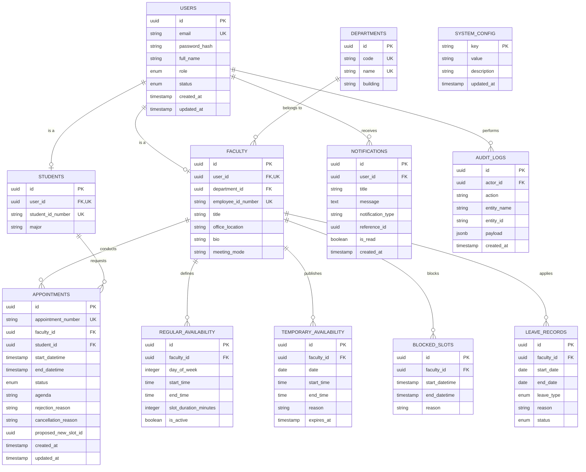
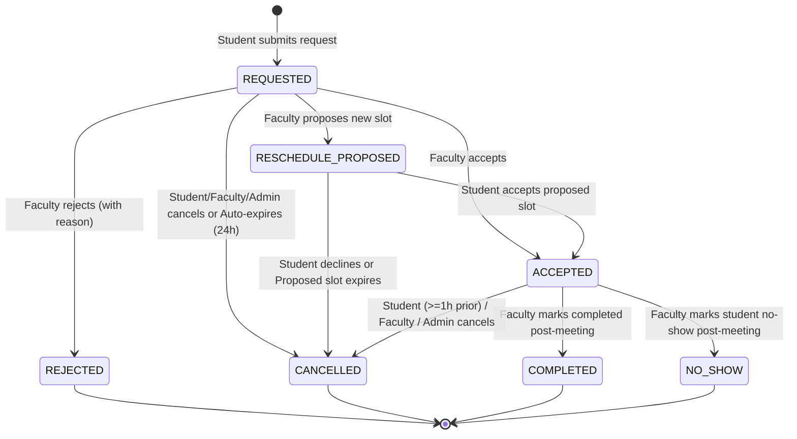
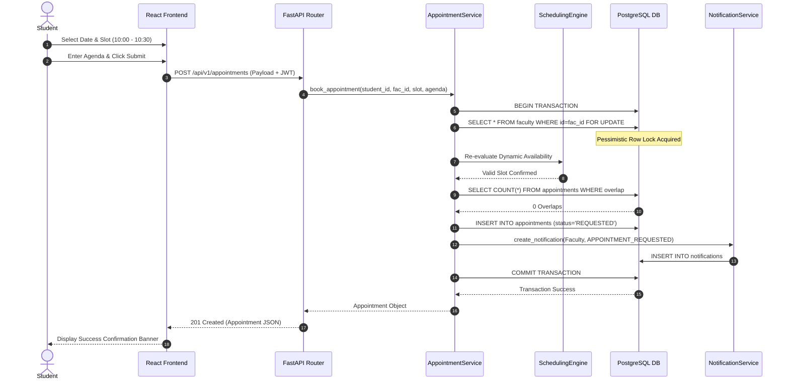
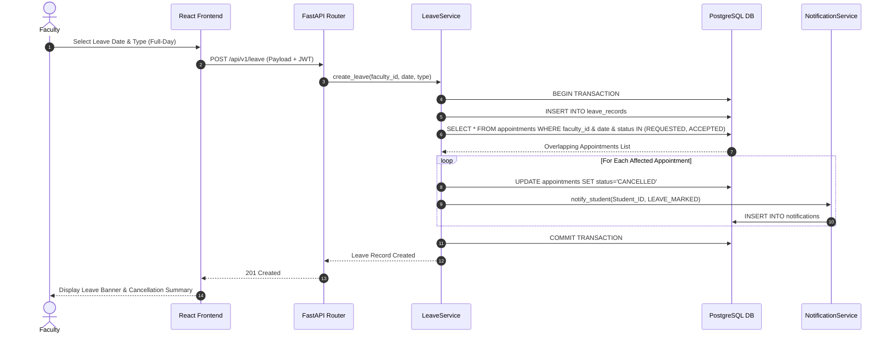

# Phase 1: Technical Architecture & Database Design Specification

**System Name:** Faculty Availability & Appointment Scheduler  
**Document Version:** 1.0.0  
**Phase:** Phase 1 — System Architecture + Database Design  
**Source of Truth:** Phase 0 Requirements & Business Rules Specification (`docs/requirements_specification.md`)  

---

## EXECUTIVE SUMMARY

This document establishes the comprehensive technical architecture and database design specification for the **Faculty Availability & Appointment Scheduler**. It transforms the business rules, functional requirements, and mathematical scheduling formulations established in Phase 0 into an implementable engineering blueprint.

The system is architected as a **Modular Monolith** using **FastAPI (Python 3.11+)**, **React (TypeScript + Vite + Tailwind CSS)**, and **PostgreSQL**. The central engine of the system is a 5-tier mathematical **Dynamic Availability Engine** that computes real-time bookable slots on-the-fly and guarantees zero double-bookings under heavy concurrent load using database-level pessimistic locking (`SELECT ... FOR UPDATE`) within strict transactional boundaries.

---

## 1. SYSTEM ARCHITECTURE

### 1.1 High-Level Architecture Overview

The system follows a modern, decoupled **Modular Monolith** architecture. A single backend application exposes RESTful APIs over HTTPS, serving a single-page React frontend application, with persistence provided by a relational PostgreSQL database.

```text
┌─────────────────────────────────────────────────────────────┐
│                 Single Page Application (SPA)               │
│                   React / TypeScript / Vite                 │
│                          Tailwind CSS                       │
└──────────────────────────────┬──────────────────────────────┘
                               │ HTTPS / REST (JSON)
                               ▼
┌─────────────────────────────────────────────────────────────┐
│                       FastAPI Backend                       │
│ ┌──────────────┐  ┌──────────────┐  ┌─────────────────────┐ │
│ │  Auth & RBAC │  │ User & Fac   │  │ Scheduling Engine   │ │
│ └──────────────┘  └──────────────┘  └─────────────────────┘ │
│ ┌──────────────┐  ┌──────────────┐  ┌─────────────────────┐ │
│ │ Appointment  │  │ Leave/Blocks │  │ Notifications       │ │
│ └──────────────┘  └──────────────┘  └─────────────────────┘ │
└──────────────────────────────┬──────────────────────────────┘
                               │ SQLAlchemy 2.0 ORM
                               ▼
┌─────────────────────────────────────────────────────────────┐
│                     PostgreSQL Database                     │
│           (ACID Transactions, Pessimistic Locking)          │
└─────────────────────────────────────────────────────────────┘
```

### 1.2 Architectural Rationales

1. **Why Modular Monolith over Microservices:**
   - The application manages a single domain bounded context (academic availability and appointment scheduling).
   - Microservices introduce distributed transaction complexity (Saga patterns, eventual consistency, two-phase commits) which contradicts the strict sub-second, atomic double-booking prevention requirement (`FR-CON-001`).
   - A modular monolith allows clean internal module separation (clear Python packages) while running in a single deployment unit with simple ACID database transactions.

2. **Frontend & Backend Communication:**
   - Stateless HTTP REST API communication exchanging JSON payloads over TLS/HTTPS.
   - OpenAPI 3.0 specification auto-generated by FastAPI to drive client API contract generation.
   - Authentication via Bearer JWT tokens in HTTP headers (`Authorization: Bearer <token>`).

3. **Domain & Responsibility Allocation:**
   - **Business Logic:** Encapsulated in the Backend Service Layer (`app/services/`). Route handlers perform zero business calculations.
   - **Scheduling Engine:** Implemented as a dedicated, pure domain service (`app/services/scheduling_engine.py`) that computes set algebra over schedule intervals.
   - **Authentication & Authorization:** Managed by FastAPI dependencies (`app/core/security.py`) enforcing JWT validation and Role-Based Access Control (RBAC).
   - **Database Transactions:** Managed explicitly at the Service layer using SQLAlchemy session transaction contexts (`with db.begin():`).

---

## 2. TECHNOLOGY STACK

| Layer / Concern | Technology | Selected Version | Architectural Justification |
| :--- | :--- | :--- | :--- |
| **Frontend Framework** | React | 18.x | Industry standard component architecture, large ecosystem, fast Virtual DOM reconciliation. |
| **Frontend Language** | TypeScript | 5.x | Enforces strict type safety across API schemas, scheduling models, and UI props, eliminating runtime standard JS bugs. |
| **Build Tooling** | Vite | 5.x | Near-instant HMR (Hot Module Replacement) and fast ES-module production bundling. |
| **Styling** | Tailwind CSS | 3.x | Utility-first styling enabling fast layout construction without custom CSS overhead or global namespace pollution. |
| **State Management** | TanStack Query (React Query) v5 | 5.x | Manages server-state caching, automatic re-fetching on slot invalidation, and optimistic UI updates without Redux boilerplate. |
| **Backend Framework** | FastAPI | 0.110+ | Asynchronous Python framework with automatic OpenAPI docs, Pydantic request/response validation, and high performance. |
| **Backend Language** | Python | 3.11+ | High readability, rich datetime libraries (`zoneinfo`), and fast execution speeds with modern CPython optimizations. |
| **Database** | PostgreSQL | 16.x | Enterprise-grade relational DB with support for row-level pessimistic locking (`FOR UPDATE`), EXCLUDE constraints, and robust ACID guarantees. |
| **ORM** | SQLAlchemy | 2.0+ | Modern asyncio-compatible Python ORM providing type-annotated models, explicit session management, and precise SQL generation. |
| **Database Migrations** | Alembic | 1.13+ | Version-controlled, schema migration framework fully integrated with SQLAlchemy models. |
| **Validation** | Pydantic | 2.x | Rust-backed data validation and serialization library native to FastAPI. |
| **Auth / Cryptography** | PyJWT + Passlib (`bcrypt`) | Latest | Industry standard JWT token signing and adaptive, salt-based password hashing resisting brute-force attacks. |
| **Testing** | Pytest + HTTPX / Vitest | Latest | Flexible backend test framework with async support and fast frontend unit/integration test execution. |

---

## 3. ARCHITECTURE LAYERS

The backend follows a strict **N-Tier Layered Architecture** with clear unidirectionality (Dependencies point inward: `API -> Services -> Domain -> Repositories -> Database`).

```text
          ┌─────────────────────────────────────────┐
          │             API / Routes                │  (FastAPI Router, HTTP Statuses, Auth Dependency)
          └────────────────────┬────────────────────┘
                               │ Request / Response Schemas (Pydantic)
                               ▼
          ┌─────────────────────────────────────────┐
          │            Services Layer               │  (Orchestration, Workflows, Transaction Boundaries)
          └──────────┬──────────────────┬───────────┘
                     │                  │
                     ▼                  ▼
┌──────────────────────────┐      ┌──────────────────────────┐
│    Scheduling Engine     │      │   Repositories Layer     │  (Pure Database Queries, SQLAlchemy CRUD)
│ (Pure Domain Set Math)   │      └────────────┬─────────────┘
└──────────────────────────┘                   │
                                               ▼
                                  ┌──────────────────────────┐
                                  │   PostgreSQL Database    │
                                  └──────────────────────────┘
```

### Layer Responsibilities

1. **API / Routes Layer (`app/api/`):**
   - Endpoints definition, path/query parameter parsing.
   - Injection of authentication credentials via dependency (`Depends(get_current_user)`).
   - Delegation of business work directly to Service methods.
   - Translation of application exceptions into structured HTTP JSON error responses.

2. **Schemas Layer (`app/schemas/`):**
   - Pydantic models validating incoming JSON bodies and defining outgoing serialization interfaces.
   - Data sanitization (trimming strings, parsing ISO datetime strings).

3. **Services Layer (`app/services/`):**
   - Implements transactional business workflows (e.g., `book_appointment`, `apply_leave`, `reschedule_appointment`).
   - Manages database transaction lifecycle (`commit`, `rollback`).
   - Triggers side-effects like generating in-app notification records.

4. **Scheduling Engine (`app/services/scheduling_engine.py`):**
   - Pure domain logic module with zero database IO or HTTP coupling.
   - Accepts raw intervals (regular schedules, temp slots, blocks, leave, existing appointments) and computes net available continuous time windows and discrete bookable slots.

5. **Repositories / Data Access Layer (`app/repositories/`):**
   - Encapsulates database read/write queries using SQLAlchemy 2.0 Select statements.
   - Implements row-level locking methods (e.g., `get_faculty_for_update()`).

---

## 4. BACKEND MODULE DESIGN

The application code is divided into **11 logical domain modules**:

```text
app/
├── modules/
│   ├── auth/
│   ├── users/
│   ├── students/
│   ├── faculty/
│   ├── departments/
│   ├── availability/
│   ├── leave/
│   ├── appointments/
│   ├── notifications/
│   ├── admin/
│   └── analytics/
```

### Module Responsibilities & Dependencies

| Module | Core Responsibility | Key Entities Owned | Dependencies |
| :--- | :--- | :--- | :--- |
| `auth` | Credentials validation, password hashing, JWT issue/refresh, role claims. | User (Read) | `users` |
| `users` | User account lifecycle, credentials management, baseline profiles. | User | `departments` |
| `students` | Student profile attributes, major, student ID numbers. | Student | `users` |
| `faculty` | Faculty profile attributes (office, bio, title, meeting mode). | Faculty | `users`, `departments` |
| `departments` | Institutional departments taxonomy, department head assignment. | Department | None |
| `availability` | Recurring weekly schedules, one-time temp availability, temp blocks. | RegularAvailability, TemporaryAvailability, BlockedSlot | `faculty` |
| `leave` | Faculty leave declarations (Full-day, Half-day, Multi-day). | LeaveRecord | `faculty`, `appointments`, `notifications` |
| `appointments` | Booking requests, lifecycle state machine, rescheduling, cancellations. | Appointment | `faculty`, `students`, `availability`, `leave`, `notifications` |
| `notifications` | In-app user notifications creation, read status tracking, feed API. | Notification | `users` |
| `admin` | Global policy overrides, system parameters config, user account status control. | SystemConfig, AuditLog | All modules |
| `analytics` | Aggregated consultation metrics, peak booking times, acceptance rates. | None (Read-only views) | `appointments`, `faculty`, `departments` |

---

## 5. DATABASE DESIGN & ER DIAGRAM

### 5.1 Entity Relationship Diagram (Mermaid)



---

## 6. DATABASE TABLE SPECIFICATION

### 1. `users`
- **Purpose:** Stores base identity, credentials, role, and system account status.
- **Primary Key:** `id` (UUIDv4)
- **Columns:**
  - `id`: `UUID` | NOT NULL | DEFAULT `gen_random_uuid()`
  - `email`: `VARCHAR(255)` | NOT NULL | UNIQUE
  - `password_hash`: `VARCHAR(255)` | NOT NULL
  - `full_name`: `VARCHAR(150)` | NOT NULL
  - `role`: `VARCHAR(20)` | NOT NULL | CHECK (`role IN ('STUDENT', 'FACULTY', 'ADMIN')`)
  - `status`: `VARCHAR(20)` | NOT NULL | DEFAULT `'ACTIVE'` | CHECK (`status IN ('ACTIVE', 'SUSPENDED', 'DEACTIVATED')`)
  - `created_at`: `TIMESTAMPTZ` | NOT NULL | DEFAULT `CURRENT_TIMESTAMP`
  - `updated_at`: `TIMESTAMPTZ` | NOT NULL | DEFAULT `CURRENT_TIMESTAMP`
- **Indexes:** `idx_users_email` (UNIQUE), `idx_users_role_status`.

### 2. `departments`
- **Purpose:** Manages institutional departments (e.g., Computer Science, Mathematics).
- **Primary Key:** `id` (UUIDv4)
- **Columns:**
  - `id`: `UUID` | NOT NULL | DEFAULT `gen_random_uuid()`
  - `code`: `VARCHAR(20)` | NOT NULL | UNIQUE (e.g., "CS", "ME")
  - `name`: `VARCHAR(150)` | NOT NULL | UNIQUE
  - `building`: `VARCHAR(100)` | NULLABLE
  - `created_at`: `TIMESTAMPTZ` | NOT NULL | DEFAULT `CURRENT_TIMESTAMP`
- **Indexes:** `idx_departments_code` (UNIQUE).

### 3. `students`
- **Purpose:** Profile extension for users with the `STUDENT` role.
- **Primary Key:** `id` (UUIDv4)
- **Foreign Keys:** `user_id` -> `users(id)` ON DELETE CASCADE
- **Columns:**
  - `id`: `UUID` | NOT NULL | DEFAULT `gen_random_uuid()`
  - `user_id`: `UUID` | NOT NULL | UNIQUE
  - `student_id_number`: `VARCHAR(50)` | NOT NULL | UNIQUE
  - `major`: `VARCHAR(100)` | NOT NULL
  - `created_at`: `TIMESTAMPTZ` | NOT NULL | DEFAULT `CURRENT_TIMESTAMP`
- **Indexes:** `idx_students_user_id` (UNIQUE), `idx_students_number` (UNIQUE).

### 4. `faculty`
- **Purpose:** Profile extension for users with the `FACULTY` role.
- **Primary Key:** `id` (UUIDv4)
- **Foreign Keys:** `user_id` -> `users(id)` ON DELETE CASCADE, `department_id` -> `departments(id)` ON DELETE RESTRICT
- **Columns:**
  - `id`: `UUID` | NOT NULL | DEFAULT `gen_random_uuid()`
  - `user_id`: `UUID` | NOT NULL | UNIQUE
  - `department_id`: `UUID` | NOT NULL
  - `employee_id_number`: `VARCHAR(50)` | NOT NULL | UNIQUE
  - `title`: `VARCHAR(100)` | NOT NULL (e.g., "Associate Professor")
  - `office_location`: `VARCHAR(100)` | NOT NULL (e.g., "Block B, Room 402")
  - `bio`: `TEXT` | NULLABLE
  - `meeting_mode`: `VARCHAR(30)` | NOT NULL | DEFAULT `'IN_PERSON'` | CHECK (`meeting_mode IN ('IN_PERSON', 'VIRTUAL', 'HYBRID')`)
  - `created_at`: `TIMESTAMPTZ` | NOT NULL | DEFAULT `CURRENT_TIMESTAMP`
- **Indexes:** `idx_faculty_user_id` (UNIQUE), `idx_faculty_department_id`, `idx_faculty_employee_id` (UNIQUE).

### 5. `regular_availability`
- **Purpose:** Defines recurring weekly availability windows for faculty members.
- **Primary Key:** `id` (UUIDv4)
- **Foreign Keys:** `faculty_id` -> `faculty(id)` ON DELETE CASCADE
- **Columns:**
  - `id`: `UUID` | NOT NULL | DEFAULT `gen_random_uuid()`
  - `faculty_id`: `UUID` | NOT NULL
  - `day_of_week`: `SMALLINT` | NOT NULL | CHECK (`day_of_week BETWEEN 0 AND 6`) (0=Monday, 6=Sunday)
  - `start_time`: `TIME` | NOT NULL
  - `end_time`: `TIME` | NOT NULL | CHECK (`end_time > start_time`)
  - `slot_duration_minutes`: `INTEGER` | NOT NULL | DEFAULT 30 | CHECK (`slot_duration_minutes IN (15, 30, 60)`)
  - `is_active`: `BOOLEAN` | NOT NULL | DEFAULT `TRUE`
  - `created_at`: `TIMESTAMPTZ` | NOT NULL | DEFAULT `CURRENT_TIMESTAMP`
- **Constraints:** CHECK (`end_time > start_time`).
- **Indexes:** `idx_reg_avail_faculty_day` (`faculty_id`, `day_of_week`, `is_active`).

### 6. `temporary_availability`
- **Purpose:** Stores one-time "pop-up" office hour windows declared by faculty.
- **Primary Key:** `id` (UUIDv4)
- **Foreign Keys:** `faculty_id` -> `faculty(id)` ON DELETE CASCADE
- **Columns:**
  - `id`: `UUID` | NOT NULL | DEFAULT `gen_random_uuid()`
  - `faculty_id`: `UUID` | NOT NULL
  - `date`: `DATE` | NOT NULL
  - `start_time`: `TIME` | NOT NULL
  - `end_time`: `TIME` | NOT NULL | CHECK (`end_time > start_time`)
  - `reason`: `VARCHAR(255)` | NULLABLE
  - `created_at`: `TIMESTAMPTZ` | NOT NULL | DEFAULT `CURRENT_TIMESTAMP`
- **Indexes:** `idx_temp_avail_faculty_date` (`faculty_id`, `date`).

### 7. `blocked_slots`
- **Purpose:** Stores one-time temporary unavailability / block periods posted by faculty or admin.
- **Primary Key:** `id` (UUIDv4)
- **Foreign Keys:** `faculty_id` -> `faculty(id)` ON DELETE CASCADE
- **Columns:**
  - `id`: `UUID` | NOT NULL | DEFAULT `gen_random_uuid()`
  - `faculty_id`: `UUID` | NOT NULL
  - `start_datetime`: `TIMESTAMPTZ` | NOT NULL
  - `end_datetime`: `TIMESTAMPTZ` | NOT NULL | CHECK (`end_datetime > start_datetime`)
  - `reason`: `VARCHAR(255)` | NOT NULL
  - `created_at`: `TIMESTAMPTZ` | NOT NULL | DEFAULT `CURRENT_TIMESTAMP`
- **Indexes:** `idx_blocked_slots_faculty_time` (`faculty_id`, `start_datetime`, `end_datetime`).

### 8. `leave_records`
- **Purpose:** Stores faculty leave declarations (Full-day, Half-day morning/afternoon, Multi-day).
- **Primary Key:** `id` (UUIDv4)
- **Foreign Keys:** `faculty_id` -> `faculty(id)` ON DELETE CASCADE
- **Columns:**
  - `id`: `UUID` | NOT NULL | DEFAULT `gen_random_uuid()`
  - `faculty_id`: `UUID` | NOT NULL
  - `start_date`: `DATE` | NOT NULL
  - `end_date`: `DATE` | NOT NULL | CHECK (`end_date >= start_date`)
  - `leave_type`: `VARCHAR(30)` | NOT NULL | CHECK (`leave_type IN ('FULL_DAY', 'HALF_DAY_MORNING', 'HALF_DAY_AFTERNOON', 'MULTI_DAY')`)
  - `reason`: `VARCHAR(255)` | NOT NULL
  - `status`: `VARCHAR(20)` | NOT NULL | DEFAULT `'APPROVED'` | CHECK (`status IN ('APPROVED', 'CANCELLED')`)
  - `created_at`: `TIMESTAMPTZ` | NOT NULL | DEFAULT `CURRENT_TIMESTAMP`
- **Indexes:** `idx_leave_faculty_dates` (`faculty_id`, `start_date`, `end_date`, `status`).

### 9. `appointments`
- **Purpose:** Stores student appointment requests and manages the state machine lifecycle.
- **Primary Key:** `id` (UUIDv4)
- **Foreign Keys:** `faculty_id` -> `faculty(id)` ON DELETE RESTRICT, `student_id` -> `students(id)` ON DELETE RESTRICT
- **Columns:**
  - `id`: `UUID` | NOT NULL | DEFAULT `gen_random_uuid()`
  - `appointment_number`: `VARCHAR(30)` | NOT NULL | UNIQUE (e.g., "APT-20260815-X9K2")
  - `faculty_id`: `UUID` | NOT NULL
  - `student_id`: `UUID` | NOT NULL
  - `start_datetime`: `TIMESTAMPTZ` | NOT NULL
  - `end_datetime`: `TIMESTAMPTZ` | NOT NULL | CHECK (`end_datetime > start_datetime`)
  - `status`: `VARCHAR(30)` | NOT NULL | DEFAULT `'REQUESTED'` | CHECK (`status IN ('REQUESTED', 'ACCEPTED', 'REJECTED', 'RESCHEDULE_PROPOSED', 'CANCELLED', 'COMPLETED', 'NO_SHOW')`)
  - `agenda`: `TEXT` | NOT NULL
  - `rejection_reason`: `VARCHAR(255)` | NULLABLE
  - `cancellation_reason`: `VARCHAR(255)` | NULLABLE
  - `proposed_new_slot_id`: `UUID` | NULLABLE
  - `created_at`: `TIMESTAMPTZ` | NOT NULL | DEFAULT `CURRENT_TIMESTAMP`
  - `updated_at`: `TIMESTAMPTZ` | NOT NULL | DEFAULT `CURRENT_TIMESTAMP`
- **Indexes:** 
  - `idx_appointments_faculty_time` (`faculty_id`, `start_datetime`, `end_datetime`, `status`)
  - `idx_appointments_student_status` (`student_id`, `status`)
  - `idx_appointments_status_time` (`status`, `start_datetime`)

### 10. `notifications`
- **Purpose:** In-app notification feed for students and faculty.
- **Primary Key:** `id` (UUIDv4)
- **Foreign Keys:** `user_id` -> `users(id)` ON DELETE CASCADE
- **Columns:**
  - `id`: `UUID` | NOT NULL | DEFAULT `gen_random_uuid()`
  - `user_id`: `UUID` | NOT NULL
  - `title`: `VARCHAR(150)` | NOT NULL
  - `message`: `TEXT` | NOT NULL
  - `notification_type`: `VARCHAR(50)` | NOT NULL (e.g., "APPOINTMENT_REQUESTED", "APPOINTMENT_ACCEPTED")
  - `reference_id`: `UUID` | NULLABLE (Appointment ID or Leave ID)
  - `is_read`: `BOOLEAN` | NOT NULL | DEFAULT `FALSE`
  - `created_at`: `TIMESTAMPTZ` | NOT NULL | DEFAULT `CURRENT_TIMESTAMP`
- **Indexes:** `idx_notifications_user_read` (`user_id`, `is_read`, `created_at`).

### 11. `system_config`
- **Purpose:** Stores key-value global system administration parameters.
- **Primary Key:** `key` (`VARCHAR(50)`)
- **Columns:**
  - `key`: `VARCHAR(50)` | NOT NULL
  - `value`: `VARCHAR(255)` | NOT NULL
  - `description`: `VARCHAR(255)` | NULLABLE
  - `updated_at`: `TIMESTAMPTZ` | NOT NULL | DEFAULT `CURRENT_TIMESTAMP`

### 12. `audit_logs`
- **Purpose:** Immutable tracking of critical state actions for institutional governance.
- **Primary Key:** `id` (UUIDv4)
- **Foreign Keys:** `actor_id` -> `users(id)` ON DELETE SET NULL
- **Columns:**
  - `id`: `UUID` | NOT NULL | DEFAULT `gen_random_uuid()`
  - `actor_id`: `UUID` | NULLABLE
  - `action`: `VARCHAR(100)` | NOT NULL (e.g., "LEAVE_CREATED", "APPOINTMENT_CANCELLED_BY_ADMIN")
  - `entity_name`: `VARCHAR(50)` | NOT NULL
  - `entity_id`: `VARCHAR(50)` | NOT NULL
  - `payload`: `JSONB` | NULLABLE
  - `created_at`: `TIMESTAMPTZ` | NOT NULL | DEFAULT `CURRENT_TIMESTAMP`

---

## 7. DATABASE NORMALIZATION & DESIGN DECISIONS

The database design adheres strictly to **Third Normal Form (3NF)**:

1. **1NF Compliance:** All attributes are atomic. Array types are avoided in core tables; relationships are explicitly represented as foreign key references or standard relational tables.
2. **2NF Compliance:** Primary keys are single-column surrogate UUIDs (`id`). All non-key columns strictly depend on the entire primary key.
3. **3NF Compliance:** No transitive dependencies exist. For example, `student_id_number` and `major` reside in `students`, while `department_id` resides in `faculty`. `users` holds only shared security attributes (`email`, `password_hash`, `full_name`, `role`).

### Pragmatic Design Decisions

- **Separate `users`, `students`, and `faculty` Tables:**
  - *Rationale:* Class-Table Inheritance pattern. Keeps the base `users` table lean for fast authentication queries while isolating role-specific attributes (e.g., `office_location` for faculty, `major` for students).
- **JSONB in `audit_logs`:**
  - *Rationale:* Audit logs capture heterogeneous snapshot payloads across varying system actions. Using `JSONB` avoids schema proliferation for logging metadata without violating 3NF in primary operational entities.

---

## 8. DATABASE CONSTRAINTS & INDEXING STRATEGY

### 8.1 Enforced Database Constraints

1. **Uniqueness:**
   - `users.email` (Case-insensitive unique index)
   - `students.student_id_number` & `students.user_id`
   - `faculty.employee_id_number` & `faculty.user_id`
   - `departments.code` & `departments.name`
   - `appointments.appointment_number`
2. **Value Validation (CHECK Constraints):**
   - `regular_availability.day_of_week BETWEEN 0 AND 6`
   - `regular_availability.end_time > regular_availability.start_time`
   - `blocked_slots.end_datetime > blocked_slots.start_datetime`
   - `appointments.end_datetime > appointments.start_datetime`
   - `users.role IN ('STUDENT', 'FACULTY', 'ADMIN')`
   - `appointments.status IN ('REQUESTED', 'ACCEPTED', 'REJECTED', 'RESCHEDULE_PROPOSED', 'CANCELLED', 'COMPLETED', 'NO_SHOW')`

### 8.2 Indexing Strategy & Query Optimization

| Index Name | Target Table | Columns | Query Pattern Supported |
| :--- | :--- | :--- | :--- |
| `idx_users_email` | `users` | `email` | User login lookup |
| `idx_faculty_dept` | `faculty` | `department_id` | Student filtering faculty by department |
| `idx_reg_avail_lookup` | `regular_availability` | `faculty_id`, `day_of_week`, `is_active` | Availability calculation engine base schedule query |
| `idx_temp_avail_lookup` | `temporary_availability` | `faculty_id`, `date` | Pop-up availability lookup for target date |
| `idx_blocked_lookup` | `blocked_slots` | `faculty_id`, `start_datetime`, `end_datetime` | Temp block interval subtraction query |
| `idx_leave_lookup` | `leave_records` | `faculty_id`, `start_date`, `end_date`, `status` | Approved leave range calculation query |
| `idx_apt_conflict_check` | `appointments` | `faculty_id`, `status`, `start_datetime`, `end_datetime` | Double-booking conflict detection & slot filtering |
| `idx_notifications_feed` | `notifications` | `user_id`, `is_read`, `created_at` | User notification bell unread counter & feed |

---

## 9. TIME AND DATE ARCHITECTURE

Handling time correctly is fundamental for an academic scheduling system.

1. **Storage Standard:**
   - All database timestamps (`TIMESTAMPTZ` columns) are stored in **UTC (Coordinated Universal Time)**.
   - Database server time zone is set to `UTC`.

2. **Institutional Timezone:**
   - Primary target institution operates in **Asia/Kolkata (IST, UTC+05:30)**.
   - Backend APIs receive and return explicit ISO 8601 strings with timezone offset (`YYYY-MM-DDTHH:MM:SS+05:30`).
   - The application parses incoming ISO datetimes into UTC before persisting to PostgreSQL.

3. **Time Boundary Rules:**
   - **No Midnight Crossing:** Appointments must reside entirely within a single calendar day (`00:00:00` to `23:59:59`). Slots crossing midnight are rejected during generation.
   - **Date Partitioning for Calculations:** Dynamic slot calculations accept a target local calendar date (`YYYY-MM-DD`), compute the corresponding local day of week (0=Monday), and calculate UTC boundaries based on `Asia/Kolkata` offset.

---

## 10. AVAILABILITY ENGINE ARCHITECTURE ⭐

The **Dynamic Availability Engine** computes bookable time slots on-the-fly without maintaining pre-rendered static slot rows in the database.

### 10.1 Mathematical Precedence Model

The continuous available set $\mathcal{A}_{\text{final}}$ for a faculty member on a date is calculated via interval set algebra:

$$\mathcal{A}_{\text{final}} = \Big( \big( \mathcal{R} \setminus \mathcal{B} \big) \cup \mathcal{T} \Big) \setminus \Big( \mathcal{L} \cup \mathcal{P} \cup \mathcal{C} \Big)$$

Where:
- $\mathcal{R}$ = Set of **Regular Availability** intervals for the given day of the week.
- $\mathcal{B}$ = Set of **Temporary Block** intervals.
- $\mathcal{T}$ = Set of published **Temporary Availability** intervals.
- $\mathcal{L}$ = Set of approved **Leave** intervals.
- $\mathcal{P}$ = Set of active **Pending (`REQUESTED`) Appointments**.
- $\mathcal{C}$ = Set of active **Confirmed (`ACCEPTED`) Appointments**.

```text
Step 1: Base Regular Weekly Schedule (R)
[09:00 ---------------------- 12:00]       [14:00 ------------ 17:00]

Step 2: Subtract Temporary Block (B) [10:30 - 11:30]
[09:00 ---- 10:30]    [11:30 - 12:00]       [14:00 ------------ 17:00]

Step 3: Union Temporary Availability (T) [12:15 - 12:45]
[09:00 ---- 10:30]    [11:30 - 12:00] [12:15 - 12:45] [14:00 ------ 17:00]

Step 4: Subtract Leave (L) (None in this example)

Step 5: Subtract Active Appointments (P + C) [09:30-10:00] & [15:00-15:30]
[09:00-09:30] [10:00-10:30] [11:30-12:00] [12:15-12:45] [14:00-15:00] [15:30-17:00]

Step 6: Slice Continuous Windows into Discrete Bookable Slots (e.g. 30-min duration)
Result: 09:00-09:30, 10:00-10:30, 11:30-12:00, 14:00-14:30, 14:30-15:00, 15:30-16:00, 16:00-16:30, 16:30-17:00
```

### 10.2 Availability Precedence Resolution Rules Matrix

| Scenario / Overlap | System Rule & Precedence Outcome | Rationale / Phase 0 Decision |
| :--- | :--- | :--- |
| **Temp Avail vs Regular Avail** | Merged into single continuous free window. | Temp availability expands regular availability seamlessly without duplicate slots. |
| **Temp Block vs Regular Avail** | Temp Block subtracts from regular availability. | Tier 3 (Block) overrides Tier 5 (Regular). |
| **Temp Block vs Temp Avail** | Temp Block subtracts from temp availability for overlapping segment. | Tier 3 (Block) overrides Tier 4 (Temp Avail). |
| **Leave vs Regular / Temp Avail** | Approved Leave negates ALL regular and temp availability. Zero slots generated. | Tier 2 (Leave) strictly overrides Tiers 4 & 5. Faculty cannot publish temp avail during Leave (Phase 0 Decision 2). |
| **Leave vs Existing Appointment** | Leave creation triggers automatic cancellation of all overlapping `REQUESTED` and `ACCEPTED` appointments. | Faculty safety & immediate student notification (Phase 0 Rule). |
| **Temp Block vs Existing Appointment** | System prevents block creation until faculty chooses Auto-Cancel or Reschedule Prompt mode. | Active appointments are Tier 1 (Highest priority). Cannot be erased silently. |
| **Appointment vs Temp Avail** | Active appointment subtracts slot from temporary availability window. | Active bookings reserve target interval regardless of availability source. |

---

## 11. SLOT GENERATION ALGORITHM

The `SlotGenerator` component converts remaining continuous free intervals into discrete bookable appointment slots.

### 11.1 Input Parameters
- `free_intervals`: List of continuous `[start_time, end_time]` intervals.
- `slot_duration`: Duration in minutes (e.g., 15, 30, or 60).
- `target_date`: Calendar date.
- `current_time`: Execution timestamp.
- `min_lead_notice`: System configured lead time (Default: 2 hours).
- `max_horizon`: System configured horizon (Default: 14 days).

### 11.2 Algorithm Execution Steps

```text
Algorithm: GenerateBookableSlots
Input: FreeIntervals, SlotDuration, TargetDate, CurrentTime, MinLeadNotice, MaxHorizon

1. Verify TargetDate is within booking horizon:
   IF TargetDate < CurrentDate OR TargetDate > CurrentDate + MaxHorizon THEN
       RETURN Empty List

2. EarliestAllowedStartTime = CurrentTime + MinLeadNotice

3. Initialize BookableSlots = []

4. FOR EACH Interval [IntervalStart, IntervalEnd] IN FreeIntervals DO:
       CurrentSlotStart = IntervalStart
       
       WHILE CurrentSlotStart + SlotDuration <= IntervalEnd DO:
           CurrentSlotEnd = CurrentSlotStart + SlotDuration
           
           -- Check Lead Notice Constraint
           IF CurrentSlotStart >= EarliestAllowedStartTime THEN
               BookableSlots.append({
                   start_datetime: CurrentSlotStart,
                   end_datetime: CurrentSlotEnd,
                   duration_minutes: SlotDuration
               })
           
           CurrentSlotStart = CurrentSlotEnd -- Advance by duration (0 buffer in MVP)
       END WHILE
   END FOR

5. RETURN BookableSlots
```

---

## 12. APPOINTMENT ARCHITECTURE & STATE MACHINE ⭐

### 12.1 State Diagram (Mermaid)



### 12.2 Valid State Transitions & Triggers

| Current State | Target State | Allowed Actor | Trigger Action / Condition | Slot Status Outcome |
| :--- | :--- | :--- | :--- | :--- |
| `[None]` | `REQUESTED` | Student | Submit booking request for open slot | Soft-locked by pending request |
| `REQUESTED` | `ACCEPTED` | Faculty | Faculty clicks "Accept" | Hard-locked by accepted appointment |
| `REQUESTED` | `REJECTED` | Faculty | Faculty clicks "Reject" (Reason required) | Slot released immediately |
| `REQUESTED` | `RESCHEDULE_PROPOSED` | Faculty | Faculty selects new target slot | New slot soft-locked; Old slot released |
| `REQUESTED` | `CANCELLED` | Student / System | Student cancels OR 24h auto-expiry | Slot released immediately |
| `RESCHEDULE_PROPOSED`| `ACCEPTED` | Student | Student accepts proposed new slot | New slot hard-locked |
| `RESCHEDULE_PROPOSED`| `CANCELLED` | Student / System | Student declines OR proposal expires | New slot released |
| `ACCEPTED` | `CANCELLED` | Student / Faculty / Admin | Cancelled (Student >= 1h notice; Faculty anytime) | Slot released to open pool if in future |
| `ACCEPTED` | `COMPLETED` | Faculty | Faculty marks successful meeting | Historical terminal state |
| `ACCEPTED` | `NO_SHOW` | Faculty | Faculty marks student absence | Historical terminal state |

---

## 13. CONFLICT DETECTION & INTERVAL MATHEMATICS

### 13.1 Overlap Condition

Two time intervals $A = [A_{\text{start}}, A_{\text{end}})$ and $B = [B_{\text{start}}, B_{\text{end}})$ overlap if and only if:

$$\max(A_{\text{start}}, B_{\text{start}}) < \min(A_{\text{end}}, B_{\text{end}})$$

### 13.2 Boundary Contact Rule

If $A_{\text{end}} = B_{\text{start}}$, the intervals touch at a single point. This is **strictly defined as NO CONFLICT**, allowing consecutive bookings (e.g., `10:00-10:30` and `10:30-11:00`).

### 13.3 Soft-Locking Rule for Pending (`REQUESTED`) Requests

Per Phase 0 Decision 3: A pending `REQUESTED` appointment **soft-locks the slot immediately**, preventing any other student from requesting or booking the same time interval while the request is pending.

---

## 14. CONCURRENCY & TRANSACTION STRATEGY ⭐

To satisfy **`FR-CON-001` (Zero Double-Bookings)** under heavy concurrent booking attempts, the application employs a database-level **Pessimistic Locking Pattern** combined with strict transaction boundaries.

### 14.1 Concurrency Prevention Mechanism

When a student submits an appointment request for a target faculty member and slot `[T_start, T_end)`:

```text
Student A Request (10:00) ──┐
                            ├─► API Gateway ──► Transaction Begin
Student B Request (10:00) ──┘                       │
                                                    ▼
                                     SELECT * FROM faculty WHERE id = :fac_id
                                              FOR UPDATE;
                                                    │
                                (Row lock acquired by Student A; Student B waits)
                                                    │
                                                    ▼
                                      Check Availability & Overlaps
                                                    │
                                ┌───────────────────┴───────────────────┐
                                ▼                                       ▼
                       Slot Available? = YES                   Slot Available? = NO
                                │                                       │
                                ▼                                       ▼
                       Insert Appointment                      Rollback Transaction
                       Commit Transaction                               │
                                │                                       ▼
                                ▼                           HTTP 409 Conflict Response
                      HTTP 201 Created                     `SLOT_NO_LONGER_AVAILABLE`
```

### 14.2 Detailed Sequence of Execution Inside Transaction Boundary

1. **Transaction Initialization:** Open database transaction: `BEGIN ISOLATION LEVEL READ COMMITTED;`
2. **Pessimistic Faculty Lock:** Execute `SELECT id FROM faculty WHERE id = :faculty_id FOR UPDATE;`
   - *Result:* Blocks any other concurrent transaction attempting to book or alter availability for this specific faculty member until current transaction completes.
3. **Active Student Limit Validation:** Check active requests for requesting student:
   - `SELECT COUNT(*) FROM appointments WHERE student_id = :student_id AND status = 'REQUESTED';`
   - IF count >= 3, abort with `400 BAD REQUEST` (`MAX_ACTIVE_REQUESTS_REACHED`).
4. **Daily Per-Faculty Student Limit Validation:** Check if student already has a booking with this faculty on target date:
   - IF count >= 1, abort with `400 BAD REQUEST` (`MAX_DAILY_BOOKINGS_PER_FACULTY_EXCEEDED`).
5. **Conflict Check:** Query overlapping active appointments:
   - `SELECT COUNT(*) FROM appointments WHERE faculty_id = :faculty_id AND status IN ('REQUESTED', 'ACCEPTED') AND (start_datetime < :end_time AND end_datetime > :start_time);`
   - IF count > 0, abort with `409 CONFLICT` (`SLOT_NO_LONGER_AVAILABLE`).
6. **Availability Verification:** Re-verify slot presence in calculated dynamic availability to guarantee non-block/non-leave interval.
7. **Insertion:** `INSERT INTO appointments (id, appointment_number, faculty_id, student_id, start_datetime, end_datetime, status, agenda) VALUES (...);`
8. **Notification:** Enqueue in-app notification insertion.
9. **Commit:** `COMMIT;` (Releases row lock instantly).

---

## 15. AUTHENTICATION & AUTHORIZATION ARCHITECTURE

### 15.1 Authentication Flow

```text
Client                       FastAPI Backend                  PostgreSQL DB
  │                                │                                │
  │─── POST /api/v1/auth/login ───►│                                │
  │    (email, password)           │─── Select user by email ──────►│
  │                                │◄── User record + password_hash │
  │                                │                                │
  │                                │─── Verify bcrypt hash ───┐     │
  │                                │    (Passlib)             │     │
  │                                │◄─────────────────────────┘     │
  │                                │                                │
  │                                │─── Generate Signed JWT ──┐     │
  │                                │    (HS256 / Secret Key)  │     │
  │                                │◄─────────────────────────┘     │
  │◄── 200 OK (JSON Body) ─────────│                                │
  │    { access_token, token_type }│                                │
```

- **Password Security:** Hashed using `bcrypt` (work factor 12) or `Argon2id`. Plaintext passwords are never stored or logged.
- **JWT Token Structure:**
  - `sub`: `user_id` (UUID)
  - `role`: `STUDENT` | `FACULTY` | `ADMIN`
  - `email`: User email string
  - `exp`: Expiration timestamp (Default: 24 hours)
  - `iss`: `faculty-scheduler-api`

### 15.2 Role-Based Access Control (RBAC) Permission Matrix

| Endpoint / Action Category | Student | Faculty | Admin |
| :--- | :---: | :---: | :---: |
| **Search & View Faculty Profiles** | READ | READ | READ |
| **View Dynamic Availability Slots** | READ | READ | READ |
| **Manage Personal Weekly Availability** | FORBIDDEN | READ / WRITE | READ / WRITE |
| **Publish Temporary Availability** | FORBIDDEN | READ / WRITE | FORBIDDEN |
| **Publish Blocked Slots / Leave** | FORBIDDEN | READ / WRITE | READ / WRITE |
| **Submit Appointment Request** | WRITE | FORBIDDEN | FORBIDDEN |
| **Accept / Reject Appointment** | FORBIDDEN | WRITE | FORBIDDEN |
| **Propose Reschedule** | FORBIDDEN | WRITE | FORBIDDEN |
| **Accept / Decline Reschedule** | WRITE | FORBIDDEN | FORBIDDEN |
| **Cancel Appointment** | WRITE (Own, >=1h) | WRITE (Own, Anytime) | WRITE (Any, Anytime) |
| **Mark Completed / No-Show** | FORBIDDEN | WRITE | WRITE |
| **Manage Users & Departments** | FORBIDDEN | FORBIDDEN | READ / WRITE |
| **Configure System Parameters** | FORBIDDEN | FORBIDDEN | READ / WRITE |
| **View Operational Analytics** | FORBIDDEN | FORBIDDEN | READ |

---

## 16. REST API ARCHITECTURE

All API endpoints reside under `/api/v1`.

### Core Endpoint Summary Table

| Category | Method | Endpoint URL | Auth / Role | Description |
| :--- | :--- | :--- | :--- | :--- |
| **Auth** | `POST` | `/api/v1/auth/login` | Public | Authenticate user, return JWT access token. |
| **Auth** | `GET` | `/api/v1/auth/me` | Authenticated | Fetch current user authenticated profile. |
| **Faculty** | `GET` | `/api/v1/faculty` | Public / Auth | Search faculty list with name/dept filters. |
| **Faculty** | `GET` | `/api/v1/faculty/{id}` | Public / Auth | Get detailed faculty profile. |
| **Availability**| `GET` | `/api/v1/faculty/{id}/availability` | Public / Auth | Query dynamic bookable slots for date range. |
| **Availability**| `POST` | `/api/v1/availability/regular` | Faculty | Define/update recurring weekly schedule. |
| **Availability**| `POST` | `/api/v1/availability/temporary` | Faculty | Publish pop-up temporary availability window. |
| **Availability**| `POST` | `/api/v1/availability/block` | Faculty / Admin | Create temporary unavailable block period. |
| **Leave** | `POST` | `/api/v1/leave` | Faculty / Admin | Submit leave declaration (Full/Half/Multi-day). |
| **Appointments**| `POST` | `/api/v1/appointments` | Student | Submit new appointment booking request. |
| **Appointments**| `GET` | `/api/v1/appointments/my` | Authenticated | List user appointment history. |
| **Appointments**| `POST` | `/api/v1/appointments/{id}/accept` | Faculty | Accept pending appointment request. |
| **Appointments**| `POST` | `/api/v1/appointments/{id}/reject` | Faculty | Reject pending request with reason. |
| **Appointments**| `POST` | `/api/v1/appointments/{id}/reschedule` | Faculty | Propose alternative appointment slot. |
| **Appointments**| `POST` | `/api/v1/appointments/{id}/respond-reschedule` | Student | Accept or decline proposed reschedule. |
| **Appointments**| `POST` | `/api/v1/appointments/{id}/cancel` | Auth (Owner/Admin) | Cancel appointment with reason. |
| **Appointments**| `POST` | `/api/v1/appointments/{id}/complete` | Faculty | Mark accepted appointment completed. |
| **Notifications**| `GET` | `/api/v1/notifications` | Authenticated | Fetch user in-app notifications feed. |
| **Notifications**| `PATCH`| `/api/v1/notifications/{id}/read` | Authenticated | Mark notification item as read. |
| **Admin** | `POST` | `/api/v1/admin/users` | Admin | Onboard new user (Student/Faculty/Admin). |
| **Admin** | `GET` | `/api/v1/admin/analytics` | Admin | Retrieve operational analytics summary. |

---

## 17. API ERROR MODEL

The API adopts a standardized JSON error format for all non-2xx responses:

```json
{
  "error": {
    "code": "SLOT_NO_LONGER_AVAILABLE",
    "message": "The selected appointment slot has already been booked by another user.",
    "details": {
      "faculty_id": "9b1deb4d-3b7d-4bad-9bdd-2b0d7b3dcb6d",
      "requested_slot": "2026-08-18T10:00:00+05:30"
    },
    "timestamp": "2026-08-15T12:34:19Z"
  }
}
```

### Standard Error Categories & Codes

| HTTP Status | Error Code | Trigger Condition |
| :--- | :--- | :--- |
| `400 Bad Request` | `VALIDATION_ERROR` | Request body schema failure (Pydantic). |
| `400 Bad Request` | `MAX_ACTIVE_REQUESTS_REACHED` | Student exceeds 3 active `REQUESTED` items. |
| `400 Bad Request` | `INSUFFICIENT_LEAD_TIME` | Booking attempt < 2 hours before slot start. |
| `401 Unauthorized` | `INVALID_CREDENTIALS` | Incorrect login email or password. |
| `401 Unauthorized` | `TOKEN_EXPIRED` | Expired Bearer JWT token. |
| `403 Forbidden` | `INSUFFICIENT_PERMISSIONS` | Student trying to accept appointment. |
| `404 Not Found` | `FACULTY_NOT_FOUND` | Invalid faculty ID parameter. |
| `409 Conflict` | `SLOT_NO_LONGER_AVAILABLE` | Concurrent booking collision (`FR-CON-001`). |
| `409 Conflict` | `INVALID_STATE_TRANSITION` | Attempting to accept a cancelled appointment. |
| `500 Internal Error`| `INTERNAL_SERVER_ERROR` | Unhandled database or system exception. |

---

## 18. NOTIFICATION ARCHITECTURE

Notifications in MVP operate via synchronous DB event logging exposed to clients via API polling.

### Event Notification Matrix

```text
[ Application Event ] ──► NotificationService.create_notification() ──► DB Table `notifications`
                                                                              │
                                                                              ▼
[ User Interface ] ◄── Poll GET /api/v1/notifications (15s interval) ─────────┘
```

| Triggering Event | Target User | Title | Message Body Template |
| :--- | :--- | :--- | :--- |
| `APPOINTMENT_REQUESTED` | Faculty | New Booking Request | Student {name} requested a slot on {date} at {time}. |
| `APPOINTMENT_ACCEPTED` | Student | Booking Confirmed | Prof. {name} accepted your appointment for {date} at {time}. |
| `APPOINTMENT_REJECTED` | Student | Request Declined | Prof. {name} declined your request. Reason: {reason}. |
| `RESCHEDULE_PROPOSED` | Student | Reschedule Proposed | Prof. {name} proposed a new time for your meeting: {new_time}. |
| `APPOINTMENT_CANCELLED` | Both | Meeting Cancelled | Appointment on {date} at {time} was cancelled by {actor}. |
| `LEAVE_MARKED` | Affected Students | Meeting Cancelled | Prof. {name} is on leave. Your appointment on {date} was cancelled. |

---

## 19. TRANSACTION BOUNDARIES & ACID ISOLATION

Transactions strictly wrap all multi-table mutations:

1. **Appointment Booking Transaction:**
   - Lock Faculty Row (`FOR UPDATE`).
   - Validate limits & check active appointment conflicts.
   - Insert `appointments` row.
   - Insert `notifications` row.
   - Commit transaction.

2. **Faculty Leave Declaration Transaction:**
   - Insert `leave_records` row.
   - Query all overlapping `REQUESTED` and `ACCEPTED` appointments.
   - Bulk UPDATE status of overlapping appointments to `CANCELLED`.
   - Bulk INSERT `notifications` for all affected students.
   - Commit transaction.

---

## 20. SECURITY & AUDITABILITY ARCHITECTURE

### 20.1 Security Protections Matrix

| Vulnerability / Concern | Architectural Mitigation |
| :--- | :--- |
| **Password Storage** | Hashed with `bcrypt` (cost factor 12) via Passlib. Plaintext never persisted. |
| **JWT Tampering** | Signed using `HS256` secret key; validated on every protected endpoint. |
| **SQL Injection** | Parameterized queries enforced natively via SQLAlchemy 2.0 ORM. |
| **Cross-Site Scripting (XSS)** | Inputs sanitized via Pydantic; React automatically escapes JSX rendering. |
| **CORS** | FastAPI `CORSMiddleware` restricting origins strictly to frontend domain. |
| **IDOR Access** | Service layer validates `appointment.student_id == current_user.student.id` or `faculty_id`. |
| **Rate Limiting** | SlowAPI middleware limiting auth endpoints to 10 req/min per IP. |

### 20.2 Auditability Specification
Immutable logging stored in `audit_logs` table for critical administrative and scheduling events:
- User login / logout
- Availability rule modifications
- Leave declarations
- Appointment cancellations (especially Admin overrides)
- User account status alterations

---

## 21. DEPLOYMENT ARCHITECTURE

The application uses **Docker** and **Docker Compose** for local development and simple single-instance container deployment.

```text
┌─────────────────────────────────────────────────────────────┐
│                    Nginx Reverse Proxy                      │
│                  (TLS Termination, Port 443)                │
└──────────────┬──────────────────────────────┬───────────────┘
               │                              │
               │ Static Files                 │ API Requests (/api/*)
               ▼                              ▼
┌──────────────────────────────┐┌──────────────────────────────┐
│  Frontend Container (React)  ││  Backend Container (FastAPI) │
│       Nginx Alpine Web       ││       Uvicorn ASGI Server    │
└──────────────────────────────┘└──────────────┬───────────────┘
                                               │ SQLAlchemy
                                               ▼
                                ┌──────────────────────────────┐
                                │ PostgreSQL 16 Database Cont. │
                                │     (Docker Persistent Vol)  │
                                └──────────────────────────────┘
```

---

## 22. PROJECT DIRECTORY STRUCTURE

```text
faculty-scheduler/
├── docs/
│   ├── requirements_specification.md
│   └── architecture_design_specification.md
│
├── backend/
│   ├── app/
│   │   ├── api/
│   │   │   ├── v1/
│   │   │   │   ├── router.py
│   │   │   │   ├── auth.py
│   │   │   │   ├── faculty.py
│   │   │   │   ├── availability.py
│   │   │   │   ├── appointments.py
│   │   │   │   ├── leave.py
│   │   │   │   ├── notifications.py
│   │   │   │   └── admin.py
│   │   │   └── dependencies.py
│   │   ├── core/
│   │   │   ├── config.py
│   │   │   ├── database.py
│   │   │   ├── security.py
│   │   │   └── exceptions.py
│   │   ├── models/
│   │   │   ├── user.py
│   │   │   ├── faculty.py
│   │   │   ├── student.py
│   │   │   ├── department.py
│   │   │   ├── availability.py
│   │   │   ├── appointment.py
│   │   │   ├── leave.py
│   │   │   └── notification.py
│   │   ├── schemas/
│   │   │   ├── auth.py
│   │   │   ├── user.py
│   │   │   ├── faculty.py
│   │   │   ├── availability.py
│   │   │   ├── appointment.py
│   │   │   └── leave.py
│   │   ├── services/
│   │   │   ├── scheduling_engine.py
│   │   │   ├── availability_service.py
│   │   │   ├── appointment_service.py
│   │   │   ├── leave_service.py
│   │   │   └── notification_service.py
│   │   └── repositories/
│   │       ├── user_repository.py
│   │       ├── faculty_repository.py
│   │       ├── availability_repository.py
│   │       └── appointment_repository.py
│   ├── alembic/
│   ├── tests/
│   │   ├── unit/
│   │   └── integration/
│   ├── Dockerfile
│   └── requirements.txt
│
├── frontend/
│   ├── src/
│   │   ├── assets/
│   │   ├── components/
│   │   │   ├── common/
│   │   │   ├── layout/
│   │   │   └── calendar/
│   │   ├── features/
│   │   │   ├── auth/
│   │   │   ├── faculty/
│   │   │   ├── availability/
│   │   │   ├── appointments/
│   │   │   └── notifications/
│   │   ├── hooks/
│   │   ├── pages/
│   │   ├── services/
│   │   ├── types/
│   │   ├── utils/
│   │   ├── App.tsx
│   │   └── main.tsx
│   ├── package.json
│   ├── tsconfig.json
│   ├── vite.config.ts
│   └── tailwind.config.js
│
├── docker-compose.yml
└── README.md
```

---

## 23. FRONTEND ARCHITECTURE & STATE DESIGN

1. **State Partitioning:**
   - **Server State:** Managed by **TanStack Query (React Query) v5**. Caches slot availability query results, appointment histories, and notifications. Automatically invalidates queries on booking or cancellation mutations.
   - **Authentication State:** Managed via React `AuthContext` holding JWT user credentials and role claims.
   - **Local UI State:** Component `useState` managing calendar view selections, form modals, and search filters.
2. **Routing:** `react-router-dom` v6 enforcing Protected Routes based on authentication role (`<ProtectedRoute allowedRoles={['FACULTY']} />`).

---

## 24. CORE DATA FLOWS (MERMAID SEQUENCE DIAGRAMS)

### 24.1 Student Appointment Booking Flow



### 24.2 Faculty Leave Declaration Flow



---

## 25. REQUIREMENT-TO-DESIGN TRACEABILITY MATRIX

| Phase 0 Requirement ID | Requirement Description | Technical Component Architecture |
| :--- | :--- | :--- |
| `FR-AUTH-001` - `004` | Authentication & RBAC | `auth` module, PyJWT, Passlib `bcrypt`, FastAPI Dependencies |
| `FR-USR-001` - `003` | User & Profile Management | `users`, `students`, `faculty` modules, Class-Table Inheritance DB Schema |
| `FR-SCH-001` - `003` | Faculty Search & Discovery | `faculty` module, `idx_faculty_dept` index, React Search Page |
| `FR-REG-001` - `003` | Regular Weekly Availability | `regular_availability` DB Table, `availability` Module API |
| `FR-TAV-001` - `004` | One-time Temporary Availability | `temporary_availability` Table, Slot Engine Tier 4 Union |
| `FR-BLK-001` - `003` | Temporary Unavailability Block | `blocked_slots` Table, Slot Engine Tier 3 Subtraction |
| `FR-LVE-001` - `003` | Leave Management | `leave_records` Table, `LeaveService` Auto-Cancellation Transaction |
| `FR-SLT-001` - `004` | Dynamic Slot Generation | `scheduling_engine.py` Interval Set Algebra & Slicing Algorithm |
| `FR-APT-001` - `005` | Appointment Lifecycle Workflow | `appointments` Table, `AppointmentService` State Machine |
| `FR-RSC-001` - `003` | Rescheduling Workflow | `AppointmentService` Soft-lock new slot & Release old slot |
| `FR-CAN-001` - `003` | Cancellation Rules | `AppointmentService` 1h Notice Check & Slot Release |
| `FR-CON-001` | Atomic Concurrency Lock | `SELECT ... FOR UPDATE` Pessimistic Lock in DB Transaction |
| `FR-NTF-001` - `002` | Real-time In-App Notifications | `notifications` Table, React Query 15s Feed Polling |
| `FR-ADM-001` - `004` | Admin Governance & Config | `system_config`, `audit_logs` DB Tables, Admin React Dashboard |

---

## 26. ARCHITECTURAL RISKS & MITIGATION STRATEGIES

| Risk Identified | Risk Severity | Architectural Mitigation Strategy |
| :--- | :---: | :--- |
| **1. Database Row Lock Contention** | Medium | Row locks are strictly scoped to single faculty IDs during active booking transactions; transactions complete in < 15ms. |
| **2. Timezone Boundary Bugs** | High | Database exclusively stores UTC `TIMESTAMPTZ`. Frontend converts exclusively to `Asia/Kolkata` for display. |
| **3. Stale Slot Display on Frontend** | Medium | TanStack Query automatically refetches slot availability upon window focus or after any booking mutation. |
| **4. Orphaned Soft-Locked Slots** | Low | Background periodic cleanup job or query-time expiration invalidates expired proposed reschedule soft-locks. |

---

## 27. ARCHITECTURAL DECISION RECORDS (ADRs)

### ADR-001: Architecture Style Selection
- **Status:** Approved
- **Decision:** Adopt a Modular Monolith architecture for Phase 2 implementation.
- **Rationale:** Microservices introduce unnecessary network overhead and distributed transactional complexity that would jeopardize sub-200ms latency and atomic double-booking prevention (`FR-CON-001`).

### ADR-002: Pessimistic Row Locking for Concurrency Control
- **Status:** Approved
- **Decision:** Use PostgreSQL row-level pessimistic locking (`SELECT ... FOR UPDATE` on the Faculty row) during slot reservation transactions.
- **Rationale:** Optimistic concurrency control (version checks) causes high retry rates during high-demand booking spikes. Pessimistic row locking guarantees deterministic FIFO ordering and zero double bookings.

### ADR-003: Dynamic On-The-Fly Availability Calculation
- **Status:** Approved
- **Decision:** Compute available slots dynamically via set algebra in memory rather than pre-generating static slot records in PostgreSQL.
- **Rationale:** Pre-generated static slot tables suffer from massive write overhead and sync corruption whenever faculty modify recurring hours, add temporary blocks, or declare leave.

---

## 28. PHASE 2 IMPLEMENTATION PLAN

Phase 2 implementation shall be executed in the following sequential 14-step roadmap:

```text
Step  1: Repository Initialization & Folder Structure Setup
Step  2: Backend FastAPI Core Configuration & Database Setup (SQLAlchemy 2.0 Async Session)
Step  3: Database Schema Migration Framework (Alembic Setup)
Step  4: SQLAlchemy Models Creation (Users, Students, Faculty, Departments, Availability, Appointments, Leave, Notifications)
Step  5: Execute Initial Alembic Database Migration
Step  6: Authentication Module (JWT Generation, Bcrypt Hashing, Login Endpoint, RBAC Dependencies)
Step  7: User & Faculty Profile Management Modules
Step  8: Core Scheduling Engine (`scheduling_engine.py` Set Algebra & Slot Generator)
Step  9: Availability Module APIs (Regular, Temporary Availability, Temporary Blocks)
Step 10: Leave Management Module & Appointment Auto-Cancellation Triggers
Step 11: Appointment Management Module & Transactional Concurrency Lock (`FR-CON-001`)
Step 12: In-App Notifications Module & Admin Governance APIs
Step 13: Frontend Setup (React, Vite, TypeScript, Tailwind CSS, TanStack Query, Protected Routes)
Step 14: Core UI Pages & Integration (Faculty Search, Dynamic Slot Picker, Booking Modal, Faculty Dashboard, Notifications Bell)
```

---

## 29. ARCHITECTURE SUMMARY & MVP BOUNDARIES

### MVP Architecture Summary
The **Faculty Availability & Appointment Scheduler** technical design provides a robust, production-grade foundation. By combining a 5-tier mathematical scheduling engine, strict relational constraints, explicit transactional state transitions, and database row-level locking, the architecture guarantees absolute double-booking prevention while maintaining high performance.

All 26 Phase 0 requirement modules, business rules, precedence rules, and edge-case behaviors are fully addressed and mapped without contradiction. Implementation can proceed immediately into Phase 2 following the 14-step roadmap.
