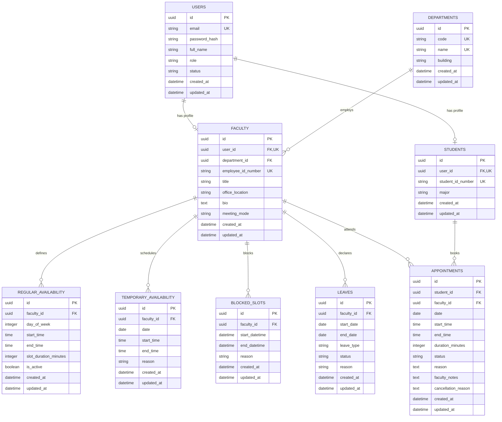

# Faculty Availability & Appointment Scheduler — Database Architecture

This document describes the relational database schema, entities, integrity constraints, and indexes for the **Faculty Availability & Appointment Scheduler**.

The database layer is managed using **SQLAlchemy 2.0 ORM** and version-controlled using **Alembic migrations**. In production, **PostgreSQL** is the required relational database engine. In local development and fast unit testing, **SQLite** is supported.

---

## 1. Entity-Relationship Diagram



---

## 2. Core Tables & Field Definitions

### 1. `users`
Central authentication and identity table.
- `id` (`UUID`, Primary Key): Unique identifier.
- `email` (`VARCHAR(255)`, Unique, Indexed): Login email address.
- `password_hash` (`VARCHAR(255)`): Salted bcrypt password hash.
- `full_name` (`VARCHAR(150)`): User's legal/display name.
- `role` (`ENUM('STUDENT', 'FACULTY', 'ADMIN')`, Indexed): Access control role.
- `status` (`ENUM('ACTIVE', 'SUSPENDED', 'DEACTIVATED')`, Indexed): Account lifecycle state.
- `created_at` / `updated_at` (`TIMESTAMP WITH TIME ZONE`).

### 2. `departments`
Academic organizational units.
- `id` (`UUID`, Primary Key).
- `code` (`VARCHAR(20)`, Unique, Indexed): Short code (e.g., `CS`, `MATH`, `EE`).
- `name` (`VARCHAR(150)`, Unique): Formal department name.
- `building` (`VARCHAR(100)`, Nullable): Campus building allocation.

### 3. `faculty`
Faculty academic profile.
- `id` (`UUID`, Primary Key).
- `user_id` (`UUID`, Foreign Key $\rightarrow$ `users.id`, Unique): 1-to-1 link to user record.
- `department_id` (`UUID`, Foreign Key $\rightarrow$ `departments.id`, Indexed): Department assignment.
- `employee_id_number` (`VARCHAR(50)`, Unique, Indexed): Institutional employee identifier.
- `title` (`VARCHAR(100)`): Academic rank (e.g. "Professor & HOD", "Associate Professor").
- `office_location` (`VARCHAR(100)`): Physical office coordinates.
- `bio` (`TEXT`, Nullable): Research focus and background.
- `meeting_mode` (`ENUM('IN_PERSON', 'VIRTUAL', 'HYBRID')`): Default consultation mode.

### 4. `students`
Student academic profile.
- `id` (`UUID`, Primary Key).
- `user_id` (`UUID`, Foreign Key $\rightarrow$ `users.id`, Unique): 1-to-1 link to user record.
- `student_id_number` (`VARCHAR(50)`, Unique, Indexed): Institutional student identifier.
- `major` (`VARCHAR(150)`): Field of study / academic discipline.

### 5. `regular_availability`
Weekly recurring office hour definitions.
- `faculty_id` (`UUID`, Foreign Key $\rightarrow$ `faculty.id`, Indexed).
- `day_of_week` (`INTEGER`, Indexed): `0` (Monday) through `6` (Sunday).
- `start_time` (`TIME`): Window start (e.g., `09:00:00`).
- `end_time` (`TIME`): Window end (e.g., `12:00:00`).
- `slot_duration_minutes` (`INTEGER`, Default `30`).
- `is_active` (`BOOLEAN`, Default `TRUE`).

### 6. `temporary_availability`
Pop-up extra office hours for specific calendar dates.
- `faculty_id` (`UUID`, Foreign Key $\rightarrow$ `faculty.id`, Indexed).
- `date` (`DATE`, Indexed): Calendar date for the one-time window.
- `start_time` / `end_time` (`TIME`).
- `reason` (`VARCHAR(255)`, Nullable).

### 7. `blocked_slots`
Temporary busy periods overriding regular hours.
- `faculty_id` (`UUID`, Foreign Key $\rightarrow$ `faculty.id`, Indexed).
- `start_datetime` / `end_datetime` (`TIMESTAMP WITH TIME ZONE`, Indexed).
- `reason` (`VARCHAR(255)`).

### 8. `leaves`
Declared faculty absences.
- `faculty_id` (`UUID`, Foreign Key $\rightarrow$ `faculty.id`, Indexed).
- `start_date` / `end_date` (`DATE`, Indexed).
- `leave_type` (`ENUM('FULL_DAY', 'HALF_DAY_MORNING', 'HALF_DAY_AFTERNOON', 'MULTI_DAY')`).
- `status` (`ENUM('APPROVED', 'PENDING', 'CANCELLED')`).

### 9. `appointments`
Student-faculty consultations.
- `student_id` (`UUID`, Foreign Key $\rightarrow$ `students.id`, Indexed).
- `faculty_id` (`UUID`, Foreign Key $\rightarrow$ `faculty.id`, Indexed).
- `date` (`DATE`, Indexed): Appointment calendar date.
- `start_time` / `end_time` (`TIME`): 30-minute interval.
- `duration_minutes` (`INTEGER`, Default `30`).
- `status` (`ENUM('REQUESTED', 'ACCEPTED', 'REJECTED', 'CANCELLED', 'COMPLETED')`, Indexed).
- `reason` (`TEXT`): Student agenda.
- `faculty_notes` (`TEXT`, Nullable): Preparation instructions from faculty.
- `cancellation_reason` (`TEXT`, Nullable).

---

## 3. Database Migration Management

Alembic migrations are stored in `backend/alembic/versions/`:
- `0b6efd9883bc`: Users, Departments, Students, Faculty
- `254a4c644b58`: RegularAvailability, TemporaryAvailability, BlockedSlot, Leave
- `7f3ffbb07770`: Appointment model

### Executing Migrations:
```bash
cd backend
alembic upgrade head
```

### Checking Migration State:
```bash
alembic current
```
